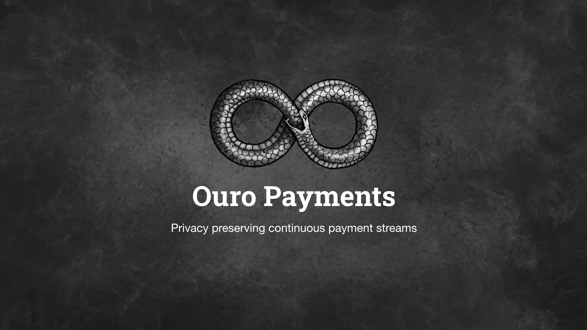

# Ouro Payments

https://ouropayments.com (Demo on Goerli using OuroDAI tokens)



[Brainstorming](https://docs.google.com/presentation/d/1d2tp1rsIX18wcOnb2jw50Y1nxk5WkAGiVk_tnERi0vQ/edit?usp=sharing)

# What

Ouro Payments is a privacy preserving payment stream service built on Raiden Network developed during the Protect Privacy hackathon fulfilling the bounty Use Raiden for fast privacy preserving payments.

The project draws inspiration from [Sablier.finance](https://Sablier.finance) but leverages the inherent privacy and scalability that Raiden Network provides to create a truly continuous payment streaming service.

Continuous payment streams allow people to capitalize on the opportunity cost of money owed to them. This can be best explained through a hypothetical example. Imagine Alice receives her salary at the end of each month. Her first day of the month salary is owed to her for ~30 days by her company. If she were to receive her salary for the first day she worked of the month she would be able to earn 30 days interest on that days salary. Individually these are small amounts but collectively account for a large amount. Monthly payments are archaic, inefficient and totally abstract that have occured from the historical pain point of making payments and accounting. Continuous streams are automated and reduce the efficiencies of staggered payments.

## Use Cases

- Salary payments - Instead of monthly payments employees receive their salaries in an hourly or daily time frame
- Rental payments - Pay your landlord daily
- Retainer contracts - Continuous payments create trust between unfamiliar companies
- Car rental - Pay each minute you use the car. (\*Thought: Pay based on km driven metric rather than just time)
- Equipment rental - Pay each minute you are in the water surfing rather than being confined to a strict time schedule

# Get started

This repo contains 4 individual applications.

## The UI

> The ui is the frontend app built using nextjs written in javascript

start static site

```
yarn dev
```

Build into static files

```
yarn build
```

(This will export the website into /ui/out)

## The Backend

> The backend is a rest api written in ReasonML using a hasura db

start server

```
yarn backend
```

## Raiden Node

> The raiden node is the node used in the demo, it requires raiden installed to run

start node

```
yarn raiden-node
```

## Desktop App

> The desktop app is the ui wrapped in electron, the idea behind the desktop app is that privacy and security can be maximised by isolating the app restricting access from potentially high risk extensions

build app (requires the ui to be built first)

```
yarn build
```

start app

```
yarn desktop
```

# Project todo list

## Outstanding

#### Static Explainer Site

- clean css

#### Dapp

- Create stream ui
- Create channel steps
- Optimize for mobile
- Add state management (redux)
- Progress bar

#### Mobile App

- Setup boilerplate
- Design UI
- Implement UI
- Read data from backend

## Non essential want-to-do's

- Static Explainer Site  
  -About Section Copy

#### Dapp

- Deploy new token
- Improve stream length input ux

## Complete

#### Static Explainer Site

- Set up hosting (trying render.com for the first time)
- Set up nextjs boilerplate
- Set up domain
- Validate dns is set up in 48hrs (thurs 13:15pm)
- Add analytics
- Favicon & Meta
- Install fonts
- Continuos deployment
- about section
- button to dapp
- button background image size optimize
- Redo favicon (maybe emoji lightning bolt)

#### Dapp

- Run a raiden node (goerli)
- Overview with steps UI

## Further Work

## Further Considerations

- Deposit switching concern
- Public withdrawal concern

# Resources, References, tools, etc

- [Brainstorming](https://docs.google.com/presentation/1d2tp1rsIX18wcOnb2jw50Y1nxk5WkAGiVk_tnERi0vQ/edit?usp=sharing)
- [MD cheatsheet](https://github.com/adam-p/markdown-here/wiki/Markdown-Cheatsheet)
- [Hosting](https://render.com)
- [Domains](https://domains.google.com)
- [NextJs Framework](https://nextjs.org/)
- [Starting Raiden Manually](https://docs.raiden.network/installation/starting-raiden-manually)(Needed for Goerli)
- [Deploy Custom Token ERC20 on Goerli](https://docs.raiden.network/using-raiden-on-testnet/use-custom-token)
- [Raiden API docs](https://docs.raiden.network/raiden-api-1/)
- [Raiden Resources, community curated](https://github.com/raiden-network/awesome-raiden)
- [Goerli OuroDAI test token](https://goerli.etherscan.io/address/0xb38981469b7235c42dda836295be8825eb4a6389)
- [NextJS & Electron](https://medium.com/@ofarukcaki/using-next-js-with-electron-f949b175da88)
- [Api Notes](./api-notes.md)

# Disclaimer

I have not received any permissions to use the logo, this project in its current form remains a proof of concept and is under active development.
